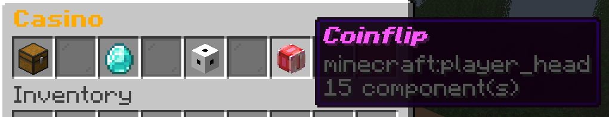
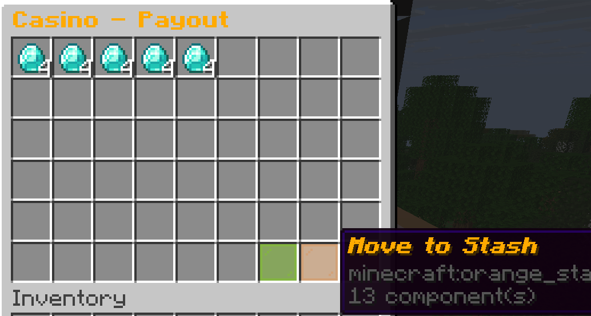
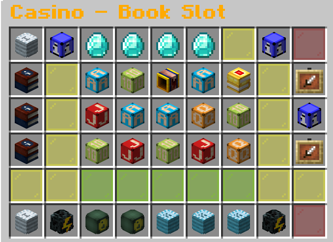

# CasinoPlugin (Paper)


Ein selbstgebautes **Minecraft Casino Plugin für Paper** mit Item-Einsätzen, mehreren Casino-Spielen, eigenem Payout-System und Stash.

Das Plugin ist für Server gedacht, auf denen Spieler nicht mit einer Economy-Währung, sondern direkt mit Items spielen.

Projekt entstand als eigenes Minecraft-Plugin mit Fokus auf GUI-Games, Casino-Feeling und sauber getrennten Spielsystemen.

---

## Features

- Zentrales Casino-Menü über `/casino`
- Eigenes Bet-Menü für Item-Einsätze
- Bis zu 5 Item-Stacks als Einsatz
- Payout-GUI für Gewinne
- Stash-System für überschüssige oder gesammelte Gewinne
- Direkter Stash-Zugriff über `/stash`
- Optionaler Citizens-NPC-Support
- Mehrere Casino-Spiele:
  - Coinflip
  - Dice
  - klassische Slot Machine
  - Book Slot

---

## Spiele

### Coinflip

Ein einfaches Kopf-oder-Zahl-Spiel.

Der Spieler wählt eine Seite, setzt Items und startet den Coinflip. Bei richtigem Ergebnis wird der Gewinn über das Payout-System ausgegeben.

### Dice

Ein Würfelspiel mit fairen Gewinnchancen pro Wurf.

Der Spieler kann 1 bis 3 Zahlen auswählen:

- 1 Zahl: 1/6 Chance, 6x Auszahlung
- 2 Zahlen: 2/6 Chance, 3x Auszahlung
- 3 Zahlen: 3/6 Chance, 2x Auszahlung

Der Einsatz wird pro Wurf verbraucht. Dadurch bleibt das Spiel mathematisch fair bei 100% ROI.

### Klassische Slot Machine

Die alte Slot Machine bleibt als eigenes Spiel erhalten.

Sie nutzt ein einfacheres Slot-System mit Symbolen, Animation und Payouts.

### Book Slot

Der Book Slot ist ein größeres 5x3 Slot-Spiel im Stil eines klassischen Casino-Slots.

Features:

- 5 Walzen und 3 Reihen
- echte Reel-Strips statt komplett zufälliger Symbole
- 10 Gewinnlinien
- Wild- und Scatter-Symbole
- Freispiele durch Scatter
- Bonus-Symbol in Freispielen
- expandierende Bonus-Symbole
- Gewinnlinien-Animationen
- Auto Spin
- Gewinne werden direkt in den Stash verschoben

---

## Einblicke

### Casino-Menü



### Payout



### Book Slot



### Book Slot Demo


---

## Commands

```text
/casino
```

Öffnet das Casino-Menü.

Aliases:

```text
/slotmachine
/sm
```

```text
/stash
```

Öffnet den Casino Stash.

---

## Download

Die aktuelle Plugin-Jar findest du unter:

[Releases](https://github.com/TillKloss/CasinoPlugin/releases)

---

## Installation

1. Repository klonen:

```bash
git clone <repository-url>
```

2. Projekt bauen:

```bash
mvn clean package
```

3. Die gebaute `.jar` aus dem `target`-Ordner in den `plugins`-Ordner des Servers kopieren.

4. Server starten oder neu laden.

Voraussetzungen:

- Java 21
- Paper Server 1.21.11
- Citizens optional, wenn Casino-NPCs genutzt werden sollen

---

## Nutzung

1. Mit `/casino` das Casino-Menü öffnen.
2. Ein Spiel auswählen.
3. Im Bet-Menü Items als Einsatz platzieren.
4. Spiel starten.
5. Gewinne im Payout-GUI einsammeln oder in den Stash verschieben.
6. Den Stash jederzeit mit `/stash` öffnen.

---

## Projektstruktur

```text
src/main/java/de/firstminecoding/casinoPlugin/
```

Wichtige Bereiche:

- `Casino/core` - Session, Handler und Basislogik
- `Casino/bet` - Bet-Menü und Einsatzverwaltung
- `Casino/payout` - Payout-GUI und Auszahlungen
- `Casino/stash` - Stash-System
- `Casino/games` - Casino-Spiele
- `Casino/citizens` - optionale NPC-Anbindung

---

## Build

Das Projekt nutzt Maven.

```bash
mvn clean package
```

Die fertige Plugin-Datei liegt danach im `target`-Ordner.

---

## Lizenz

Frei nutzbar und erweiterbar.
